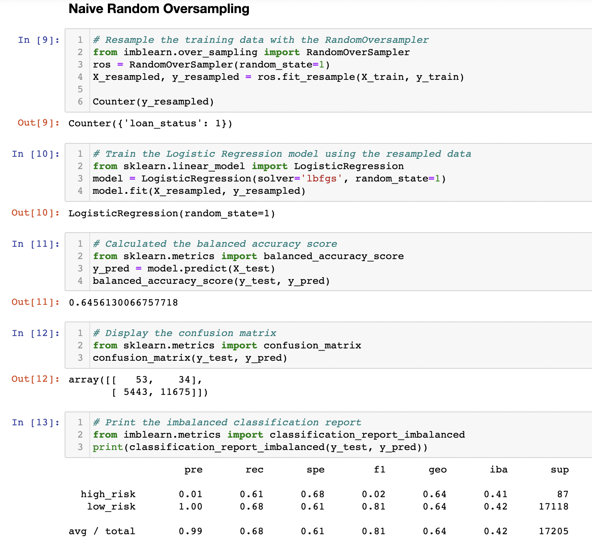
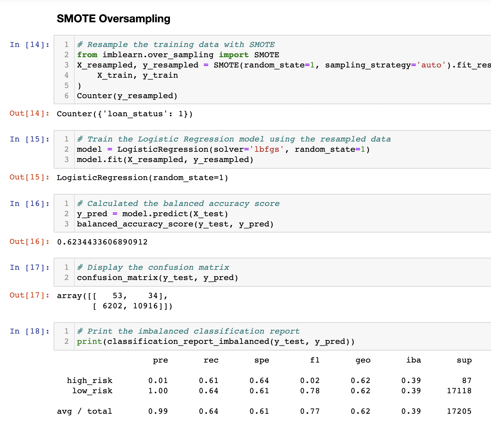
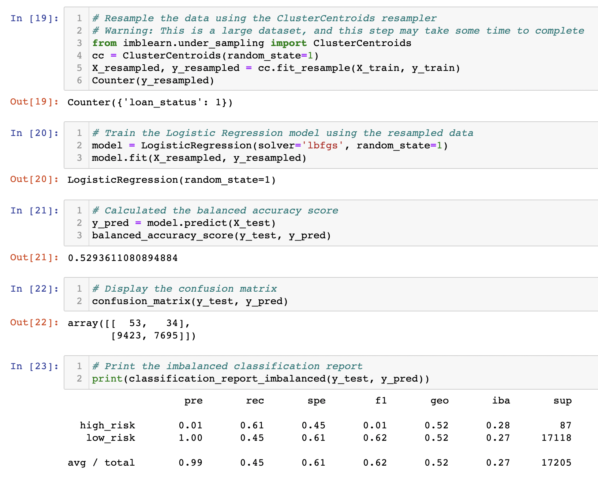
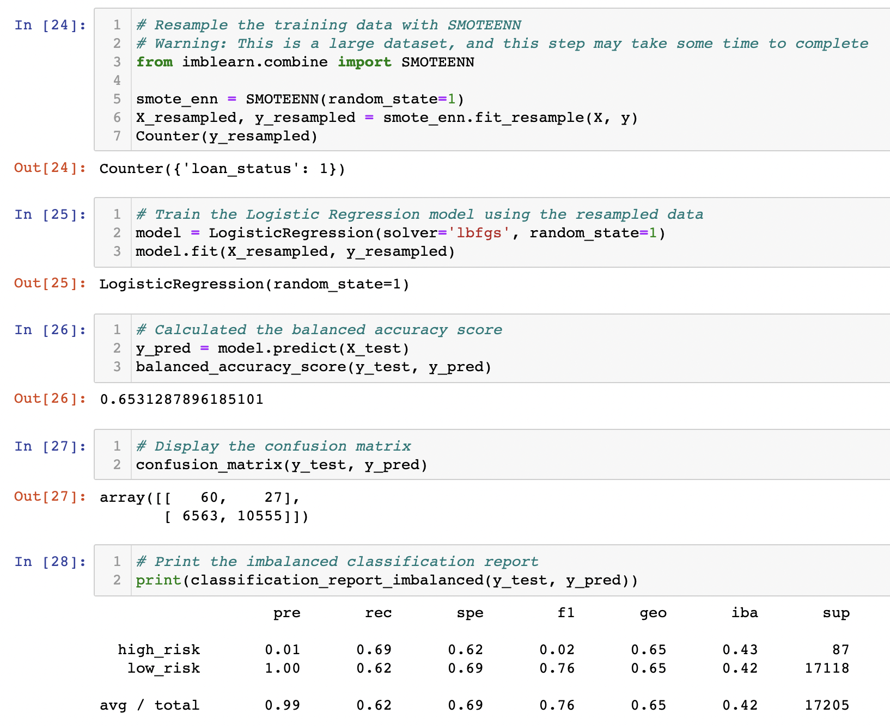
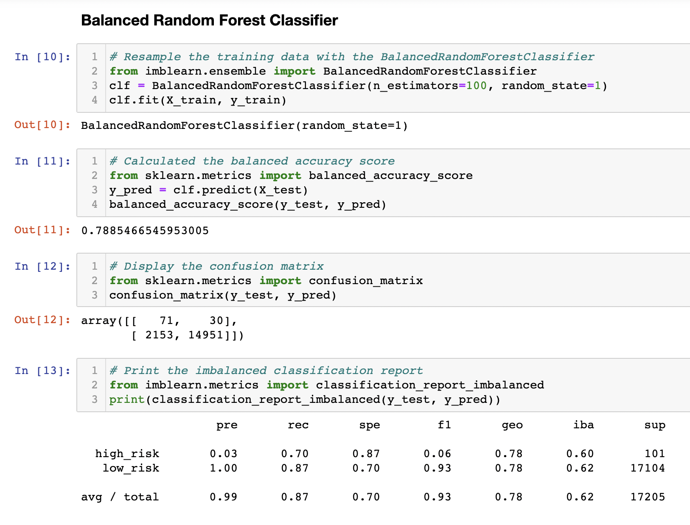
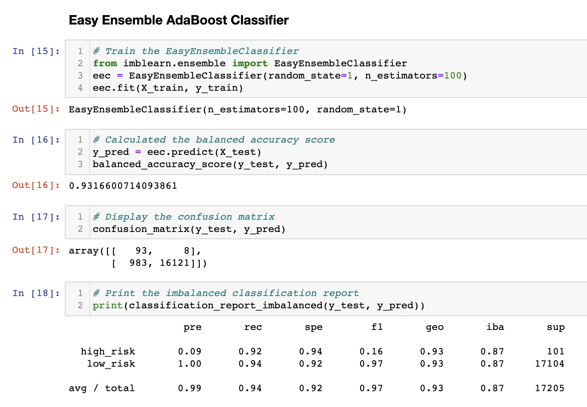
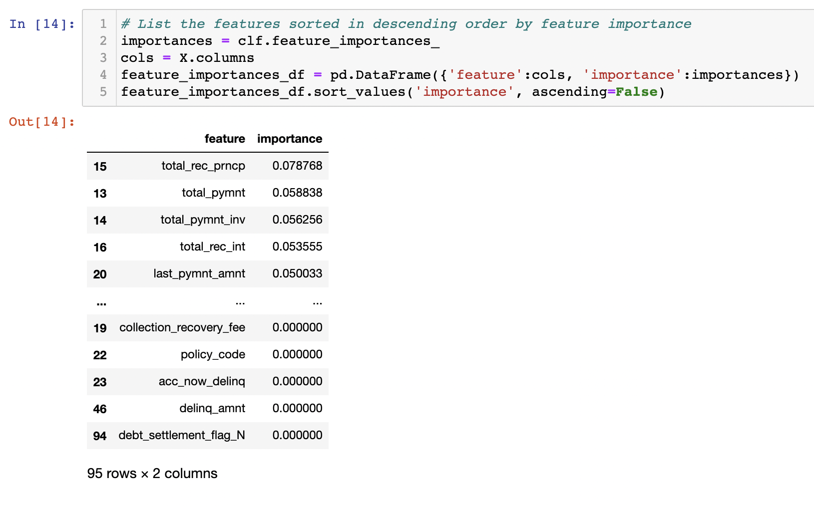

# Credit Risk Analysis

## Overview of the Analysis

I am applying machine learning models to predict credit risk of an individual. 

For this analysis, I am comparing various machine learning models that reduce bias to predict this credit risk. I am using BalancedRandomForestClassifier and EasyEnsembleClassifier. I am using an oversample technique to also predict credit risk, RandomOverSampler and SMOTE. Lastly, I am using an under sampling and combinational approach to again predict credit risk, ClusterCentroids and SMOTEENN. Additionally, I am going to evaluate the performance of all these models and include the written recommendation in the summary section. 

## Results
1) 
    This model has a low balanced accuracy score and recall score. 

2) 
    This model has a low balanced accuracy score and recall score. 
    
3) 
    This model has the lowest balanced accuracy score and recall score. 

4) 
    This model has a low balanced accuracy score and recall score.

5) 
    This model has a better balanced accuracy score, 78.9% and a better recall score of 87% for identifying low credit risk and 70% for identifying high credit risk. 

6) 
    This model has the best balanced accuracy score, 93.2%, which means that 93% of the time it will accurately predict the credit risk of an individual. Additional, its recall, or sensitivity, for predicting low credit risk is 94% and 92% for predicting high credit risk. This means that it will catch a large number of low and high risk individuals even though they may not necessarily be risky. 

    This image lists the importance of each feature in descending order in regards to how important it is in learning how to identify if an individual possess a credit risk. 
    
## Summary
In conclusion, I am recommending that the EasyEnsemble AdaBoost Classifier be implemented in predicting the credit risk of an individual. This model had the highest balanced accuracy which means that it will accurately predict the risk level of an individual. Additionally, the recall, or sensitivity, is high, above 92%, indicating that it may assign an incorrect credit risk to an individual which will require further investigation. However, this will lead to better protection for the company in that it will not be giving risky credit to individuals that may have a troublesome or even fraudulent representation. Lastly, of all the prediction models, this one had the lowest number of instances in which the prediction was false but it was actually true. For this line of work, we need a model that will not allow an individual to slip through the prediction model but rather be labeled high credit risk and require more follow-up and verification. 